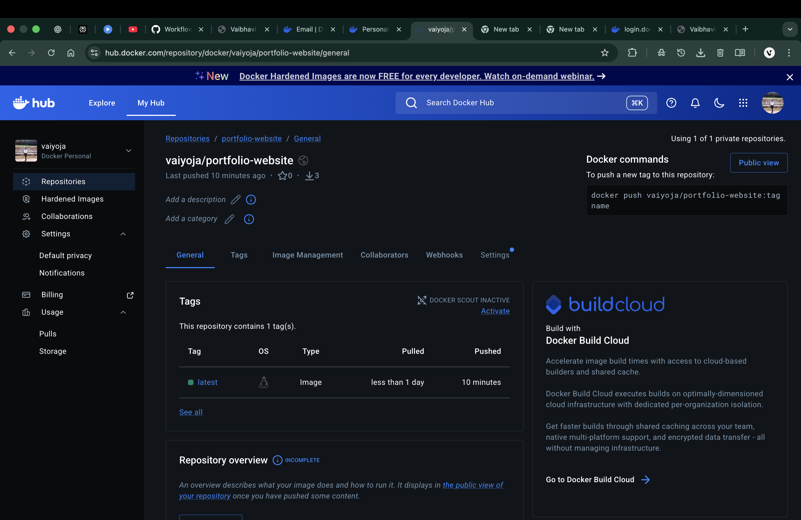
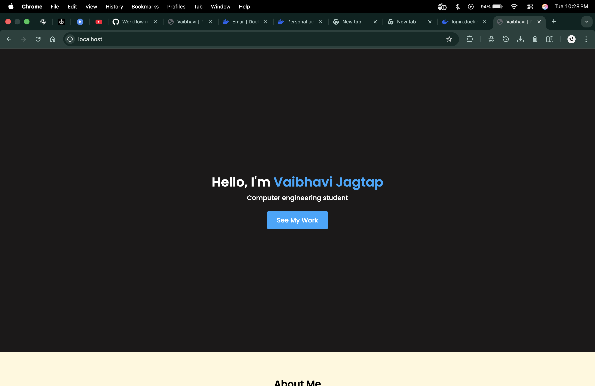
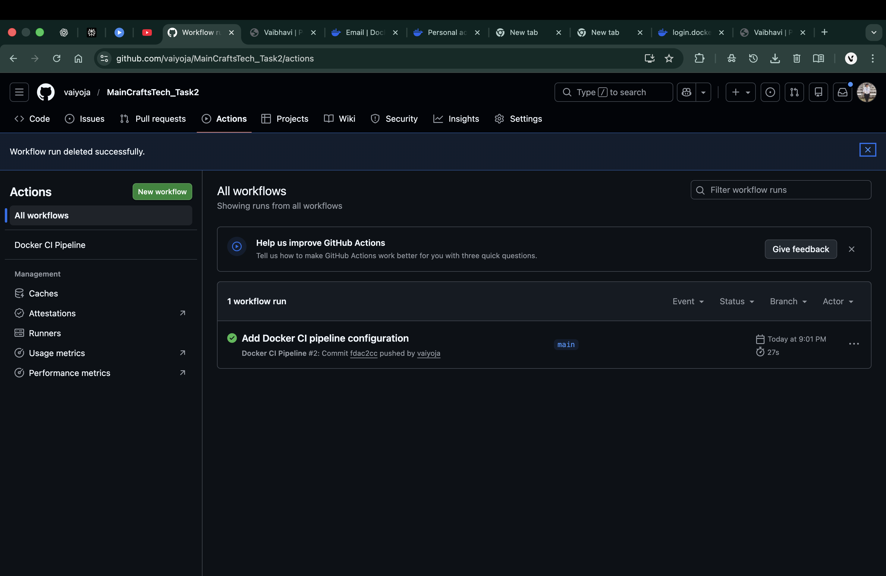
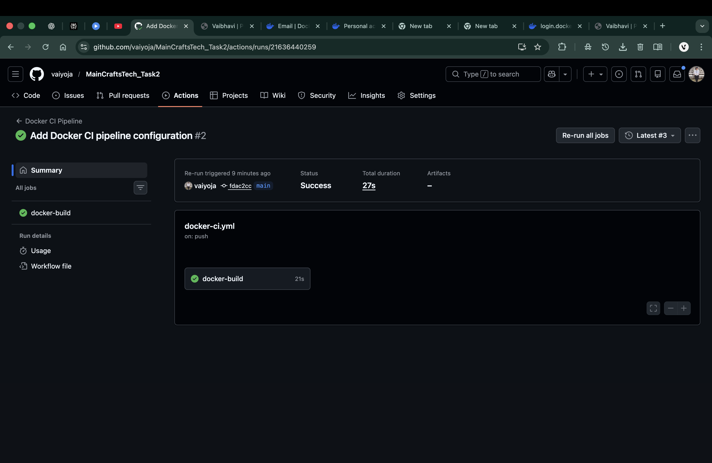

# Cloud Computing & DevOps – Task 3  
## CI/CD Automation for Dockerized Application using GitHub Actions

---

## 📌 Task Overview
This repository documents the completion of **Task 3 – CI/CD Automation** as part of the **Cloud Computing & DevOps Internship** at **Maincrafts Technologies**.

The objective of Task 3 was to design and implement a **Continuous Integration (CI) pipeline** using **GitHub Actions** to automatically build a Docker image and push it to **Docker Hub** whenever changes are pushed to the main branch.

---

## ⚠️ Important Note on Repository Usage

The **CI/CD pipeline implementation and execution for Task 3 were carried out in the Task-2 repository**, which already contained the Dockerized application developed in the previous task.

This approach follows **real-world DevOps best practices**, where CI/CD pipelines are integrated directly into the existing application repository to maintain continuity and avoid duplication.

👉 This **Task-3 repository is maintained for documentation, screenshots, and submission purposes**, clearly presenting the CI/CD workflow, execution proof, and validation results.

---

## 🔗 Reference Repository (CI/CD Implementation)

The complete CI/CD configuration and execution are available in the Task-2 repository:

🔗 **Task-2 Repository:**  
https://github.com/vaiyoja/MainCraftsTech_Task2

---

## 🛠️ Tools & Technologies Used
- Git & GitHub  
- GitHub Actions  
- Docker  
- Docker Hub  
- YAML  

---

## ⚙️ CI Pipeline Description
The CI pipeline implemented in the Task-2 repository is triggered automatically on every push to the `main` branch and performs the following steps:

1. Checks out the source code from GitHub  
2. Logs in to Docker Hub using GitHub Secrets  
3. Builds a Docker image using the Dockerfile  
4. Pushes the Docker image to Docker Hub  

This automation eliminates manual Docker build and push operations.

---

## 🔐 Secrets Management
To ensure security, Docker Hub credentials are stored using **GitHub Secrets**:

- `DOCKER_USERNAME` – Docker Hub username  
- `DOCKER_PASSWORD` – Docker Hub access token (with write permission)

These secrets are securely accessed inside the GitHub Actions workflow.

---

## 📦 Docker Hub Image
The Docker image generated by the CI pipeline:

---

## 🚀 Image Validation (Step 8)
After successful execution of the CI pipeline, the Docker image was validated by:

- Pulling the image from Docker Hub  
- Running the container locally  
- Accessing the application through a web browser  

This confirms that the Docker image created by the CI pipeline is functional and deployment-ready.

---

## 📸 Screenshots & Proof of Execution

### 1️⃣ Docker Hub Repository (Image Available)

---

### 2️⃣ Application Running on Localhost

---

### 3️⃣ GitHub Actions – Workflow Success

---

### 4️⃣ GitHub Actions – Workflow Run Summary

---

## ✅ Task Outcome
- CI pipeline successfully implemented using GitHub Actions  
- Docker image build and push fully automated  
- Secure secrets handling achieved  
- Docker image validated successfully  
- Task-3 completed as per internship requirements  

---

## 👩‍💻 Author
**Vaibhavi Jagtap**  
Cloud Computing & DevOps Intern  
Maincrafts Technologies
